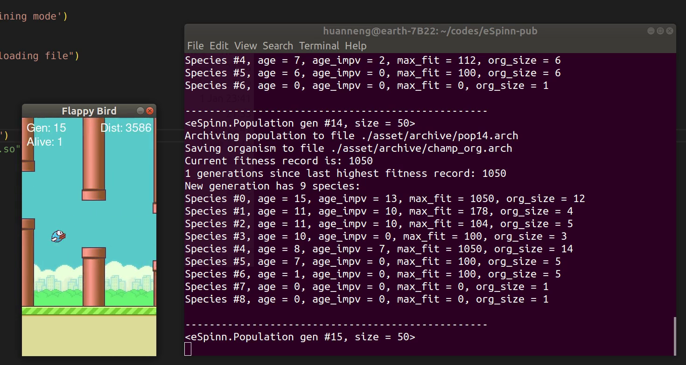

# FlapyBird

A Flappy Bird Game implementation engined by [`pygame`](https://www.pygame.org/).
Game is re-written based on https://github.com/sourabhv/FlapPyBird in an OOP style.

This project was developed & tested on Ubuntu 16.04, using `python3.7.6`.


## Prerequisites

- `python3.7`
- `pygame`


## Getting Started

```sh
git clone https://github.com/hnqiu/FlappyBird.git
cd FlappyBird/
python3 -m pip install -r requirements.txt
python3 flappybird.py --easy
```
Game can be set in 3 modes: `easy`, `median` and `difficult`. Use
```sh
python3 flappybird.py -h
```
to get the usage information.

## More
Check out how I used machine learning to [train an AI bird](https://github.com/hnqiu/eSpinn?tab=readme-ov-file#example-running-flappy-bird):




## Author
- [hnqiu](https://github.com/hnqiu)
